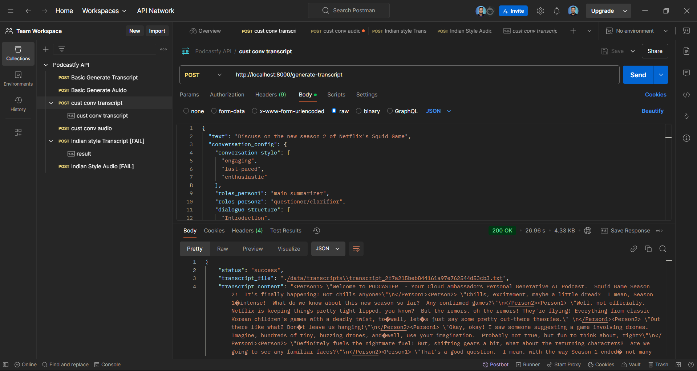
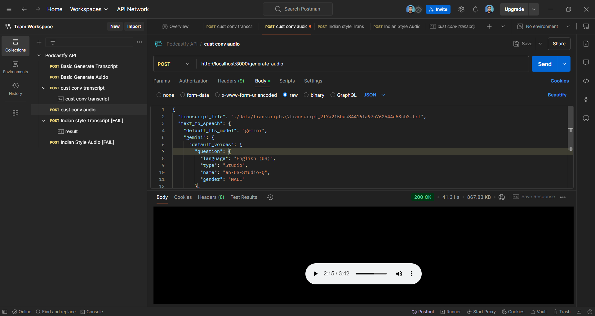

## Generate Transcript

- Sample Input:
- Request: POST
- API: `http://localhost:8000/generate-transcript`

```json
{
  "text": "Discuss on the new season 2 of Netflix's Squid Game",
  "conversation_config": {
    "conversation_style": ["engaging", "fast-paced", "enthusiastic"],
    "roles_person1": "main summarizer",
    "roles_person2": "questioner/clarifier",
    "dialogue_structure": [
      "Introduction",
      "Main Content Summary",
      "Conclusion"
    ],
    "podcast_name": "PODCASTER",
    "podcast_tagline": "Your Cloud Ambassadors Personal Generative AI Podcast",
    "output_language": "English",
    "engagement_techniques": [
      "rhetorical questions",
      "anecdotes",
      "analogies",
      "humor"
    ],
    "creativity": 1,
    "user_instructions": "Focus on making the content accessible to a general audience",
    "max_num_chunks": 8,
    "min_chunk_size": 600
  },
  "text_to_speech": {
    "default_tts_model": "gemini",
    "gemini": {
      "default_voices": {
        "question": {
          "language": "English (US)",
          "type": "Studio",
          "name": "en-US-Studio-Q",
          "gender": "MALE"
        },
        "answer": {
          "language": "English (US)",
          "type": "Studio",
          "name": "en-US-Studio-O",
          "gender": "FEMALE"
        }
      }
    }
  }
}
```

Response:

```json
{
  "status": "success",
  "transcript_file": "./data/transcripts\\transcript_2f7a215beb844161a97e762544d53cb3.txt",
  "transcript_content": "<Person1> \"Welcome to PODCASTER  - Your Cloud Ambassadors Personal Generative AI Podcast.  Squid Game Season 2!  It's finally happening! Got chills anyone?\"\n</Person1><Person2> \"Chills, excitement, maybe a little dread?  I mean, Season 1�intense!  What do we know about this new season so far?  Any confirmed games?\"\n</Person2><Person1> \"Well, not officially. Netflix is keeping things pretty tight-lipped, you know?  But the rumors, oh the rumors! They're flying! Everything from classic Korean children's games with a deadly twist, to�well, let�s just say some pretty out-there theories.\" \n</Person1><Person2> \"Out there like what? Don�t leave us hanging!\"\n</Person2><Person1> \"Okay, okay! I saw someone suggesting a game involving drones.  Imagine, hundreds of tiny, buzzing drones, and�well, use your imagination.  Probably not true, but fun to think about, right?\"\n</Person1><Person2> \"Definitely fuels the nightmare fuel! But, shifting gears a bit, what about the returning characters?  Are we going to see any familiar faces?\"\n</Person2><Person1> \"That's a good question.  I mean, with the way Season 1 ended� not many candidates left, are there?   But I'd be shocked if we didn�t see some flashbacks, maybe even exploring the backstories of the Front Man or some of the VIPs.\" \n</Person1><Person2> \"Oooh, the Front Man! His story is ripe for exploration! I mean, who is he? What�s his motivation? Uh, so many questions!\"\n</Person2><Person1> \"Exactly! And the VIPs?  Ugh, those creepy masks.  I�m dying to know more about them. Their motivations, their� everything! I mean, are they really that detached from the value of human life? Disturbing, right?\" \n</Person1><Person2> \"Totally!  Speaking of disturbing, what about the level of violence?  Season 1 was� brutal.  Can we expect the same level of intensity in Season 2, or will they dial it back? What do you think?\" \n</Person2><Person1> \"Hmm, tough one. Part of me hopes they don�t shy away from the brutality because, in a way, it highlighted the desperation of the players.   But, uh� another part of me wouldn't mind a little less�gore.\" \n</Person1><Person2> \"I see. Interesting. Makes sense.  It's a delicate balance, isn�t it?  Between portraying the stark reality and� well, being gratuitous.\" \n</Person2><Person1> \"Absolutely.  And let's not forget the social commentary!  Season 1 was powerful in its critique of capitalism and economic inequality. Hoping Season 2 continues that thread, maybe delves even deeper. What do you predict?\" \n</Person1><Person2> \"Totally agree!  I think it's essential they keep that element. Maybe exploring the global implications of the games?  Or perhaps diving deeper into the motivations of the individuals who participate?  I mean, what drives them to such extremes?\"\n</Person2><Person1> \"Good points. And, you know, I'm curious to see how they handle the international attention the show received. Will they incorporate that into the narrative somehow? Maybe have players from different countries?\" \n</Person1><Person2> \"That would be brilliant!  Imagine the cultural clashes!  The different strategies!  The tension!  Oh, the possibilities!\" \n</Person2><Person1> \"Right? So much potential!  We're definitely in for a wild ride.  Anything else you're particularly hoping to see in Season 2?\" \n</Person1><Person2> \"Hmm� maybe a little more focus on the emotional impact of the games on the players? I mean, we saw glimpses of it in Season 1, but I�d love to see more exploration of the psychological toll it takes.\" \n</Person2><Person1> \"Got it.  That would definitely add another layer of depth to the show. I agree!  Well, I think we've covered just about everything we know (and speculate) about Squid Game Season 2!  Any final thoughts before we wrap up?\"\n</Person1><Person2> \"Just� bring on the games!  (But, you know, not really.  Just, uh, on TV.)\" \n</Person2><Person1> \"Haha! Exactly!  Thanks for joining me on PODCASTER. We'll be back soon with more discussions on all things pop culture! Until then, stay safe, and don't get any�squid game ideas.\" </Person1>"
}
```

- https://cloud-ambassadors-0244.postman.co/workspace/Team-Workspace~28182627-ac9d-41c0-826d-193a12586724/request/40745152-0f142c8a-20ca-429e-afb0-17dd3f8428bf?action=share&creator=40745152&ctx=documentation



---

## Generate Audio

- Sample Input:
- Request: POST
- API: `http://localhost:8000/generate-audio`

```json
{
  "transcript_file": "./data/transcripts\\transcript_2f7a215beb844161a97e762544d53cb3.txt",
  "text_to_speech": {
    "default_tts_model": "gemini",
    "gemini": {
      "default_voices": {
        "question": {
          "language": "English (US)",
          "type": "Studio",
          "name": "en-US-Studio-Q",
          "gender": "MALE"
        },
        "answer": {
          "language": "English (US)",
          "type": "Studio",
          "name": "en-US-Studio-O",
          "gender": "FEMALE"
        }
      }
    }
  }
}
```



Response: <br>
<audio controls src="podcast_c10c8b3ea3904275adef8998a57ad171.mp3" title="Title"></audio>

---
